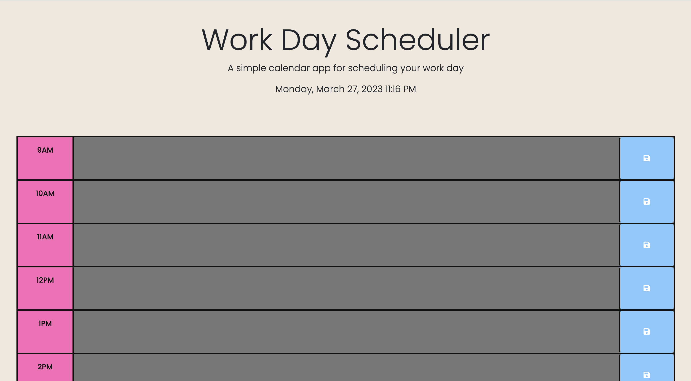
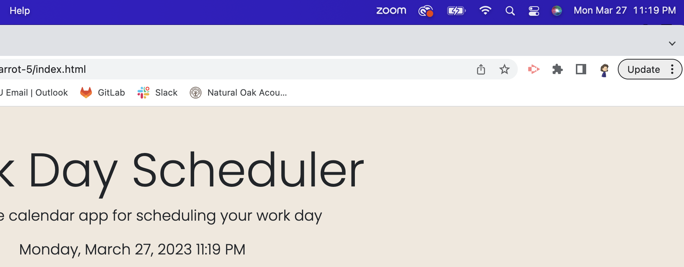
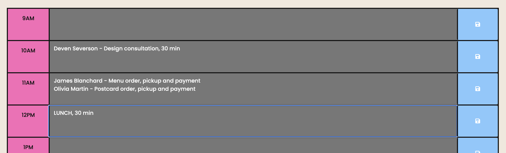

# glowing-carrot-5
The Module 5 Challenge utilizes third-party APIs to create a functional work day scheduler which reflects the hour and date in real time as well as stores input data for the user.

[My Work Day Scheduler](https://hipster-rufus.github.io/glowing-carrot-5)

[Repository: glowing-carrot-5](https://www.github.com/hipster-rufus/glowing-carrot-5)

# Description
I found that creating this webpage was a lot easier with the use of third-party APIs to shorten and simplify the code in my JavaScript file. It is also easier to focus on the functionality of a webpage when the HTML and CSS files are already ready to go. 
To figure out the code for the webpage, I simply followed the comments on the script.js file and structured my code in that order. I worked my way through each section of the webpage completely before trying to figure out the next, starting with the easiest section (displaying the date) to the hardest (changing the colors of the time blocks) as my JavaScript skills are not the strongest. I was constantly referencing our previous class challenges as well as the APIs documents provided for this challenge.
Finally, after my script.js file was fully functional, I restyled the webpage a little using a bright and dynamic color palette and a new font family.

# Usage
To use my Work Day Schedule webpage, simply follow [this link](https://hipster-rufus.github.io/glowing-carrot-5)!

With your current local date and time displayed at the top (see proof below), you will be able to keep up with your day-to-day operations at work by filling out each hourly time block according to your tasks. 

Simply clicking the save button on the right side saves all your input data so you can continually update throughout the day with no worries of lost data. 

Each hourly time block visually reflects the current hour during the day, as well as the past and present hours, so keeping your daily responsibilities organized is no problem. 

# Credits
[Day.js](https://day.js.org/en/)
[jQuery](https://api.jquery.com/)
[Our DU Bootcamp "Textbook"](https://git.bootcampcontent.com/University-of-Denver/DU-VIRT-FSF-PT-02-2023-U-LOLC)

# License
N/A